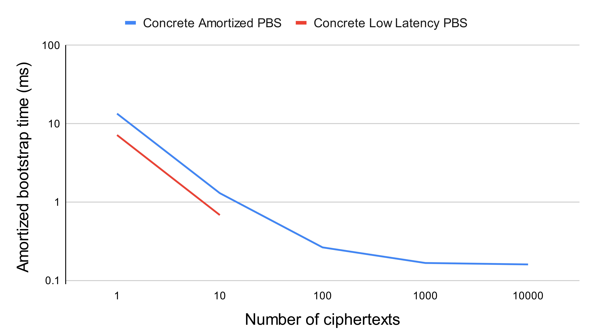

# Cuda backend

This backend implements Cuda accelerated versions of the bootstrap and the keyswitch over single inputs, or over vectors of inputs.
It also implements conversion engines to be able to transfer data to the GPU and back to the CPU.

## Dependencies

This backend relies on Cuda acceleration, it thus requires having the Cuda drivers and toolkit installed.
You'll need [nvcc](https://docs.nvidia.com/cuda/cuda-installation-guide-linux/index.html) >= 10.0, [gcc](https://gcc.gnu.org/) >= 8.0 and [cmake](https://cmake.org/) >= 3.8.

There are two engine structures in the Cuda backend: the `CudaEngine` and the `AmortizedCudaEngine`. The first is suited to the acceleration of 1 up to about 10 bootstraps at once (depending on the cryptographic parameters), whereas the second one is most performant when bootstrapping a larger amount of inputs at once (from about 10 till the maximum capacity of global memory on the GPU has been reached).

## Engines

### Cuda engine
This engine implements some data conversions, to copy from the CPU to the GPU:
+ LWE ciphertexts and vectors of ciphertexts
+ GLWE ciphertexts and vectors of ciphertexts
+ Bootstrap keys
+ Keyswitch keys

And to copy from the GPU to the CPU:
+ LWE ciphertexts and vectors of ciphertexts

It also implements a Cuda accelerated version of the keyswitch over single LWE inputs, or vectors of inputs.
Finally, it implements the bootstrap over single LWE inputs or vectors of inputs, relying on a Cuda kernel that accelerates the whole bootstrap (or a whole set of bootstraps).
This kernel relies on an in-house negacyclic FFT and iFFT implementations for the Fourier transformations.
This bootstrap implementation performs best for small amounts of bootstraps at once, and is actually limited in the number of bootstraps it can handle at once.
Each bootstrap is executed using several Cuda blocks, and synchronization between blocks is performed using the cooperative groups feature of Cuda. 
It is best suited to the computation of the bootstrap over 1 to about 10 input ciphertexts (we refer to it as the Low Latency Bootstrap).

### Amortized Cuda engine
This engine only implements the bootstrap over input vectors of LWE ciphertexts. It performs best when computing the bootstrap over quite large
amounts of inputs (it starts being interesting from about 10 simultaneous inputs). Once again the Cuda kernel accelerates the full set of bootstraps, each bootstrap being computed in one Cuda block.
The implementation is very similar to the one proposed by nuFHE, but we support more parameter sets. We refer to this implementation as the Amortized Bootstrap.

## Supported parameter sets

The Cuda engine supports polynomial sizes among 512, 1024, 2048. The base logarithm used in the decomposition cannot exceed 16, and the GLWE dimension is hard set to 1.
On the other hand, the amortized Cuda engine has the same restrictions on the base log and GLWE dimension, but it supports polynomial sizes among 512, 1024, 2048, 4096 and 8192.

## Benchmark results

Below comes a comparison between the nuFHE implementation, the Amortized Bootstrap and the Low Latency Bootstrap. 
The parameter set is fixed so as to be supported by nuFHE. 
nuFHE exposes two PBS implementations: one relying on an NTT (in yellow below) and another relying on an FFT (in green below). 
We compare the time it takes to execute one bootstrap when launching various amounts of bootstraps at once. 
We consider from 1 up to 10,000 bootstraps launched at once. The Amortized Bootstrap of Concrete-core is plotted in blue 
and the Low Latency one in red (the later can only launch a restricted amount of PBS at once, which is why there are only two points on the curve).
This Figure shows that for small amounts of bootstraps launched at once, the Low Latency implementation of Concrete performs best. 
On the other hand, when launching large amounts of bootstraps at once the nuFHE implementations and the Amortized bootstrap implementation perform similarly. 
For intermediate amounts of bootstraps, the nuFHE implementation relying on the FFT performs best (but keep in mind it only supports a very limited set of cryptographic parameters).



The benchmarking results shown above only relate to one set of cryptographic parameters, but bear in mind that performance varies depending on the parameters' choice. In order to ease the user's life, we have introduced cost and noise models for the Cuda accelerated operations. Those will be integrated into Zama's Optimizer and Compiler, which take care of choosing the best parameters and hardware for the user.


## Tutorial
In this tutorial we'll see how to execute the Cuda accelerated bootstrap over one LWE input. Note that you'll achieve the best performance by batching as many inputs as possible into one bootstrap launch, and by using the amortized Cuda engine.

In the `Cargo.toml` file, you just need to add `backend_cuda` to the features activated on `concrete-core`:
```shell
concrete-core = {version = "=1.0.0", features=["backend_default", "backend_cuda", "backend_default_parallel"]}
```
Once again let's just start by defining some cryptographic parameters (with no safety guarantee in the example, just like in the other tutorials), and inputs:
```rust
     // DISCLAIMER: the parameters used here are only for test purpose, and are not secure.
     let (lwe_dim, lwe_dim_output, glwe_dim, poly_size) = (
         LweDimension(130),
         LweDimension(512),
         GlweDimension(1),
         PolynomialSize(512),
     );
     let noise = Variance(2_f64.powf(-29.));
     let (dec_lc, dec_bl) = (DecompositionLevelCount(3), DecompositionBaseLog(7));
     // Choose an input message (and encode it to the most significant bits of the u64 value)
     let input = 3_u64 << 60;
     // Here we'll apply an identity function during the bootstrap, without redundancy in the lookup table
     // So the resulting noise will be that of the modulus switch
     let mut lut = vec![0u64; poly_size.0];
     let log_degree = f64::log2(poly_size.0 as f64) as i32;
     for i in 0..poly_size.0 {
         let l = (i as f64 * 2_f64.powi((64 - log_degree - 1) as i32)) as u64;
         lut[i] = l;
     }
```
Let's now create the engines we're going to use in the tutorial: they're the same as in the FFT backend tutorial, with the addition of the Cuda engine:
```rust
     // Create the necessary engines
     // Here we need to create a secret to give to the unix seeder, but we skip the actual secret creation
     const UNSAFE_SECRET: u128 = 0;
     let mut default_engine = DefaultEngine::new(Box::new(UnixSeeder::new(UNSAFE_SECRET))).unwrap();
     let mut parallel_engine = DefaultParallelEngine::new(Box::new(UnixSeeder::new(UNSAFE_SECRET))).unwrap();
     let mut cuda_engine = CudaEngine::new(()).unwrap();
```
In this tutorial, we'll use the `h_` prefix to designate data on the CPU (host), and the `d_` prefix to 
designate data on the GPU (device). Let's start by creating the necessary data on the CPU, just like in the FFT backend tutorial:
```rust
     // Encrypt the input message
     let h_input_key: LweSecretKey64 = default_engine.generate_new_lwe_secret_key(lwe_dim).unwrap();
     let h_input_plaintext: Plaintext64 = default_engine.create_plaintext_from(&input).unwrap();
     let mut h_input_ciphertext: LweCiphertext64 =
         default_engine.encrypt_lwe_ciphertext(&h_input_key, &h_input_plaintext, noise).unwrap();
     // create a GLWE ciphertext containing an encryption of the LUT
     let h_lut_plaintext_vector = default_engine.create_plaintext_vector_from(&lut).unwrap();
     let h_lut_key: GlweSecretKey64 = default_engine.generate_new_glwe_secret_key(glwe_dim, poly_size).unwrap();
     let h_lut = default_engine.trivially_encrypt_glwe_ciphertext(glwe_dim.to_glwe_size(), &lut_plaintext_vector).unwrap();
     // create a BSK with multithreading
     let h_bootstrap_key: LweBootstrapKey64 =
         parallel_engine.generate_new_lwe_bootstrap_key(&h_input_key, &h_lut_key, dec_bl, dec_lc, noise).unwrap();
     // initialize an output LWE ciphertext
     let h_output_ciphertext: LweCiphertext64 =
     default_engine.trivially_encrypt_lwe_ciphertext(lwe_dim.to_lwe_size(), &h_input_plaintext).unwrap();
```
We now have all the necessary data on the CPU. Let's copy them to the GPU:
```rust
     // convert input to the GPU
     let d_input_ciphertext: CudaLweCiphertext64 =
         cuda_engine.convert_lwe_ciphertext(&h_input_ciphertext).unwrap();
     // convert accumulator to GPU
     let d_input_lut: CudaGlweCiphertext64 = cuda_engine.convert_glwe_ciphertext(&h_lut).unwrap();
     // convert BSK to GPU (and from Standard to Fourier representations)
     let d_fourier_bsk: CudaFourierLweBootstrapKey64 =
         cuda_engine.convert_lwe_bootstrap_key(&h_bootstrap_key).unwrap();
     let mut d_output_ciphertext: CudaLweCiphertext64 =
         cuda_engine.convert_lwe_ciphertext(&h_zero_output_ciphertext).unwrap();
```
Here the bootstrap key conversion also included the conversion from the standard to the Fourier domain via an FFT.
We're now ready to launch the bootstrap:
```rust
     // launch the bootstrap on GPU
     cuda_engine.discard_bootstrap_lwe_ciphertext(
         &mut d_output_ciphertext,
         &d_input_ciphertext,
         &d_input_lut,
         &d_fourier_bsk,
     ).unwrap();
```
We can then copy the result back to the CPU:
```rust
     h_output_ciphertext: LweCiphertext64 =
        cuda_engine.convert_lwe_ciphertext(&d_output_ciphertext).unwrap();
```
And we're done, executing your code will run the bootstrap on GPU! 
